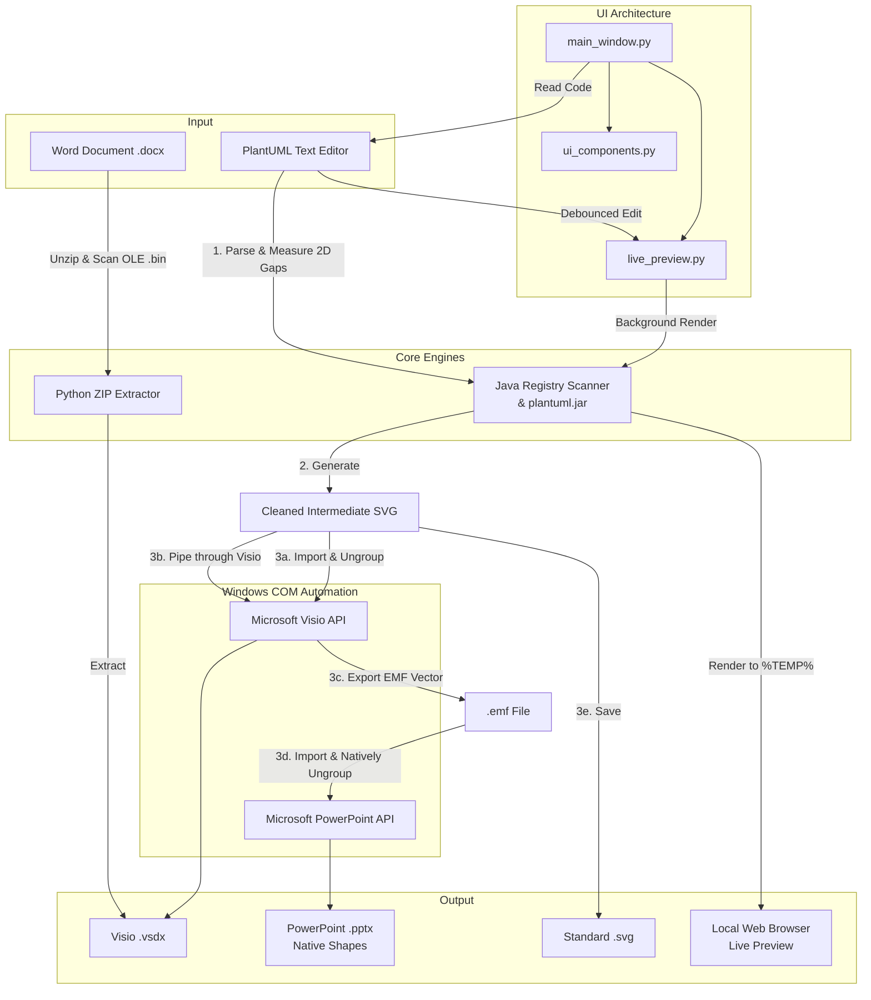

# 📊 PlantUML to Visio/PowerPoint Converter (3GPP Tools)

An advanced desktop application designed to bridge the gap between text-based diagramming (`PlantUML`) and corporate enterprise environments (`Microsoft Visio` and `PowerPoint`). 

Built specifically with telecommunications and 3GPP standards workflows in mind, this tool allows you to write highly efficient PlantUML sequence and activity diagrams and instantly export them as fully editable native Office shapes.

> **🤖 AI-Assisted Development:** > The architecture, UI polishing, and complex Microsoft COM automation in this project were heavily co-developed using Large Language Models (LLMs), allowing for rapid iteration and deep integration into native Windows APIs.

---

## 📑 Table of Contents
1. [✨ Features](#features)
2. [🏗️ Architecture & Data Flow](#architecture)
3. [⚙️ Prerequisites](#prerequisites)
4. [🚀 Installation](#installation)
5. [📖 How to Use the GUI](#usage)
6. [🛠️ Known Quirks / Troubleshooting](#troubleshooting)
7. [📜 License](#license)

---

## <a id="features"></a>✨ Features

* **Real-Time Live Preview:** A debounced, background rendering engine that automatically pipes your PlantUML code to a live browser tab as you type. 
* **Intelligent 2D Text Parsing:** Bypasses Visio's text-shattering limitations by measuring X/Y coordinates and pixel gaps. This guarantees that side-by-side branch labels in Activity Diagrams (like `yes` / `no`) remain completely separate, rather than merging into single overlapping shapes.
* **Native PowerPoint Export (The EMF Pipeline):** Bypasses PowerPoint's buggy SVG engine by silently piping the diagram through Visio to generate a Microsoft **Enhanced Metafile (.emf)**. This guarantees a flawless, natively ungroupable Office Drawing object.
* **Bulletproof Java Discovery Engine:** Bypasses stale Windows Terminal paths by actively scanning both `PATH` variables and raw Windows Registry entries to automatically locate and utilize the highest installed Java version (perfectly parsing modern tags like `25.0.3+9`).
* **Smart Proxy & JAR Synchronization:** Automatically downloads the correct PlantUML version architecture (`modern` vs `legacy`). Includes a built-in proxy tester to ping GitHub before saving network settings.
* **Word Document Extractor:** Extracts hidden, embedded Visio (`.vsdx`) files natively trapped inside Word Document (`.docx`) OLE wrappers.
* **Modular UI Architecture:** Built on a clean, maintainable, multi-file UI standard with a professional, IDE-style queue manager.

---

## <a id="architecture"></a>🏗️ Architecture & Data Flow



---

## <a id="prerequisites"></a>⚙️ Prerequisites

Because this application relies heavily on Microsoft's Component Object Model (COM) to natively manipulate diagrams, it requires a specific environment:

1. **Windows OS** (Required for COM automation).
2. **Microsoft Visio** and **Microsoft PowerPoint** installed locally.
3. **Java Runtime Environment (JRE)** (Java 11+ recommended to support the newest PlantUML features; Java 8 minimum. The tool will auto-detect the best version).
4. **Python 3.8+**

---

## <a id="installation"></a>🚀 Installation

1. **Clone the repository:**
   ```bash
   git clone [https://github.com/telekom/3gpp-meeting-tools.git](https://github.com/telekom/3gpp-meeting-tools.git)
   cd 3gpp-meeting-tools/puml2visio
   ```

2. **Install the required Python packages:**
   Create a virtual environment (optional but recommended) and install dependencies:
   ```bash
   pip install PyQt5 pywin32
   ```

3. **Run the application:**
   ```bash
   python puml2visio.py
   ```
   *Note: On first launch, the app will automatically attempt to download `plantuml.jar`. If you are behind a corporate firewall, a proxy configuration dialog will appear to assist. You can click "Test Connection" to verify your proxy credentials.*

---

## <a id="usage"></a>📖 How to Use the GUI

The application features three main workspaces navigated via tabs, with a fully resizable bottom terminal and queue viewer.

### 📝 Tab 1: Paste Code (Single Diagram Mode)
* **Live Preview:** Click the `👁️ Live Preview` toggle. The app will open a browser tab and automatically render your diagram as you type (waits for a 750ms pause to save CPU). Note: Un-toggling stops the rendering, but you must close the browser tab manually.
* **Export:** Paste your PlantUML diagram code into the text box. Click `Export Visio`, `Export PPTX`, or `Export SVG`. The application will generate the file, copy its path to your clipboard, and automatically open it.
* **Round-Trip Extract:** If you previously generated a Visio file using this tool, drag and drop the `.vsdx` file directly into the text box to instantly retrieve your original source code.

### 📂 Tab 2: Drag & Drop Files (Batch Mode)
* Drag a selection of `.txt` or `.puml` files from your file explorer and drop them onto the dashed area. 
* The application will queue them up in the **Queue Viewer** at the bottom right. You can select items in the queue and click `Remove` to cancel them before they process.

### 📄 Tab 3: Word Extractor
* When collaborating on 3GPP standards, Visio files are often deeply embedded inside Word documents as OLE objects. 
* Drag and drop a `.docx` file onto this tab. The app will unzip the `.docx` archive in milliseconds, extract the clean `.vsdx` files, and place them right next to your original Word document.

### 🛠 System Toolbar (Console Header)
* **📡 Proxy:** Update your network configuration on the fly and test the connection to GitHub.
* **🔄 Update JAR:** Force the application to ping GitHub and check if a newer version of PlantUML is available to download.

---

## <a id="troubleshooting"></a>🛠️ Known Quirks / Troubleshooting

* **PowerPoint "Leave Open" Behavior:** Unlike Visio exports (which save silently to your disk), clicking `Export PPTX` intentionally leaves the generated PowerPoint presentation open and unsaved on your screen. This allows you to immediately copy the generated slide and paste it directly into your master deck. 
* **COM Errors:** If Visio or PowerPoint crash in the background, invisible instances of the programs might get stuck in your system's memory. If you start receiving `COM Error` messages in the app console, open Windows Task Manager and end any lingering background processes for `Visio.exe` or `PowerPoint.exe`.
* **Missing Visio Source Code Alignment:** Modifying the PlantUML `textLength` attributes manually might cause Visio text boxes to behave erratically. The tool automatically cleans standard SVG artifacts, but highly customized `skinparam` settings may override this.

