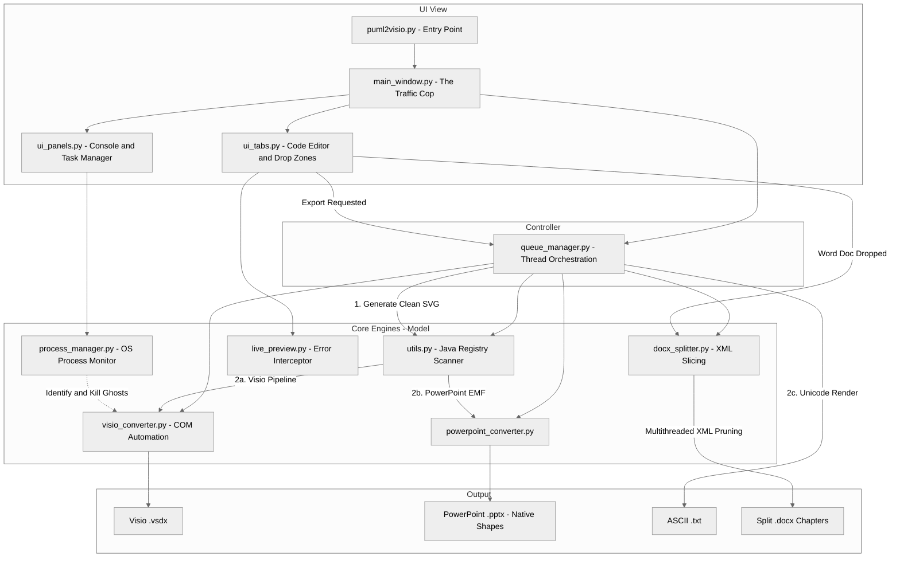

# 📊 PlantUML to Visio/PowerPoint Converter (3GPP Tools)

An advanced, component-based desktop IDE designed to bridge the gap between text-based diagramming (`PlantUML`) and corporate enterprise environments (`Microsoft Visio` and `PowerPoint`). 

Built specifically with telecommunications and 3GPP standards workflows in mind, this tool allows you to write highly efficient PlantUML sequence, activity, and network diagrams, instantly export them as fully editable native Office shapes, and rapidly slice massive specification documents into manageable chapters.

---

## 📑 Table of Contents
1. [✨ Features](#features)
2. [🏗️ Architecture & Data Flow](#architecture)
3. [⚙️ Prerequisites](#prerequisites)
4. [🚀 Installation](#installation)
5. [📖 How to Use the GUI](#usage)
6. [🛠️ Known Quirks / Troubleshooting](#troubleshooting)
7. [📜 License](#license)

---

## <a id="features"></a>✨ Features

* **Smart Code Editor:** A professional IDE experience featuring dynamic line numbering, active-line highlighting, native Undo/Redo history, and a background Auto-Save Cache that restores your session if the app is closed or crashes.
* **Intelligent Live Preview:** A debounced background rendering engine that automatically pipes your PlantUML code to a live browser tab as you type. If you make a typo, it intercepts the Java crash and dynamically paints a red Syntax Error overlay directly in your browser.
* **Rich Export Engine:** * **Visio (.vsdx):** Perfect alignment via 2D SVG gap-measuring.
  * **PowerPoint (.pptx):** Bypasses buggy SVG engines via an EMF pipeline for natively ungroupable objects.
  * **ASCII Text Art (.txt):** Uses PlantUML's `-tutxt` engine to generate clean Unicode text diagrams for markdown or RFC specs.
* **Subtractive Slicing Engine (Word):** Instantly split massive 200+ page `.docx` specifications into individual clauses. Processes files at the XML level (bypassing slow COM automation) using a throttled Thread Pool to extract multiple chapters simultaneously without maxing out system RAM.
* **XML Garbage Collector:** When splitting Word documents, automatically scans the surviving XML and aggressively purges orphaned OLE objects and high-res images to prevent file bloat.
* **Embedded Visio Extractor:** Extracts hidden, editable Visio (`.vsdx`) files natively trapped inside Word Document (`.docx`) OLE wrappers.
* **Built-in COM Process Manager:** A native "kill switch" dialog that safely identifies and terminates headless "ghost" instances of Visio or PowerPoint left hanging in memory by background crashes.
* **Modular MVC Architecture:** Built on a decoupled UI standard, utilizing dedicated UI Tabs, UI Panels, and a centralized Python `QueueManager` to handle threading without locking the GUI.

---

## <a id="architecture"></a>🏗️ Architecture & Data Flow



---

## <a id="prerequisites"></a>⚙️ Prerequisites

Because this application relies heavily on Microsoft's Component Object Model (COM) and native XML parsing, it requires a specific environment:

1. **Windows OS** (Required for COM automation).
2. **Microsoft Visio** and **Microsoft PowerPoint** installed locally.
3. **Java Runtime Environment (JRE)** (Java 11+ recommended to support the newest PlantUML features; Java 8 minimum. The tool will auto-detect the best version).
4. **Python 3.8+**

---

## <a id="installation"></a>🚀 Installation

1. **Clone the repository:**
   ```bash
   git clone [https://github.com/telekom/3gpp-meeting-tools.git](https://github.com/telekom/3gpp-meeting-tools.git)
   cd 3gpp-meeting-tools/puml2visio
   ```

2. **Install the required Python packages:**
   Create a virtual environment (optional but recommended) and install the dependencies (including `python-docx` for XML manipulation):
   ```bash
   pip install -r requirements.txt
   ```

3. **Run the application:**
   ```bash
   python main.py
   ```
   *Note: On first launch, the app will automatically attempt to download `plantuml.jar`. If you are behind a corporate firewall, a proxy configuration dialog will appear to assist.*

---

## <a id="usage"></a>📖 How to Use the GUI

The application features three main workspaces navigated via tabs, with a fully resizable bottom terminal and queue viewer.

### 📝 Tab 1: Code Editor (Single Diagram Mode)
* **Auto-Save & Undo:** The editor saves your work every 2 seconds to a hidden cache file. Click `↩️ Undo` to restore accidental deletions.
* **Live Preview:** Click `👁️ Live Preview` to open a real-time browser rendering of your code. Syntax errors will highlight in red with precise line numbers.
* **Exporting:** Click `📤 Export Diagram ▼` to select your format (.vsdx, .pptx, .svg, or .txt). The app will dynamically update the `🔗 Copy Path` button for instant clipboard access.
* **Round-Trip Extract:** Drag and drop a generated `.vsdx` file into the text box to retrieve its original PlantUML source code.

### 📂 Tab 2: Batch Convert
* Drag `.txt` or `.puml` files onto the dashed area. They will queue up in the **Queue Viewer**. You can highlight queue items and click `Remove` before they process.

### 📄 Tab 3: Word Extractor & Splitter
* **Extract Embedded Visio Diagrams:** Unzips the `.docx` archive and dumps clean `.vsdx` files (often trapped as OLE objects in 3GPP specs) next to your original document.
* **Subtractive Slicing (Split by Clause):** Select this radio button to intelligently carve up a massive specification document.
  * **Prefix:** Define the clause to target (e.g., `6.` targets 6.1, 6.2, etc.).
  * **Depth:** Define the hierarchy level to cut at (e.g., Depth `2` slices at 6.1, Depth `3` slices at 6.1.1).
  * The tool creates a `[filename]_split` subfolder and processes the chapters in parallel, purging orphaned images to keep file sizes small.

### 🛠 System Toolbar (Console Header)
* **🖥️ Task Manager:** Open the COM Process Manager to identify and kill headless instances of Visio or PowerPoint.
* **📡 Proxy:** Update network configuration on the fly.
* **🔄 Update JAR:** Ping GitHub for newer versions of PlantUML.

---

## <a id="troubleshooting"></a>🛠️ Known Quirks / Troubleshooting

* **COM Errors & File Locks:** If Visio or PowerPoint crash in the background, invisible instances of the programs might get stuck in your system's memory and lock your files. Click the **🖥️ Task Manager** button in the app console and click **Kill Ghosts** to instantly clear them out without losing your active work.
* **Word Splitter Memory Throttling:** Slicing a heavy `.docx` file unzips a massive XML tree into your RAM. To prevent memory crashes and disk thrashing, the parallel processing is hard-capped at 3 maximum threads. You will see the chapters output in batches of 3 in the console.
* **PowerPoint "Leave Open" Behavior:** Unlike Visio exports (which save silently to your disk), clicking `Export PPTX` intentionally leaves the generated PowerPoint presentation open and unsaved so you can immediately copy the slide.
* **Missing Visio Source Code Alignment:** Modifying the PlantUML `textLength` attributes manually might cause Visio text boxes to behave erratically during export.
