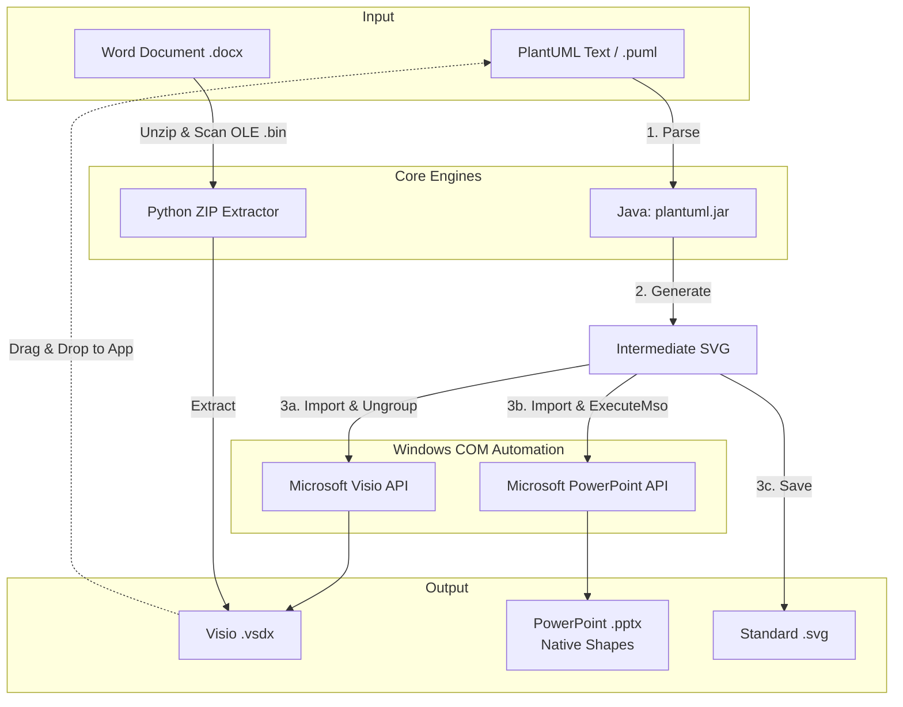
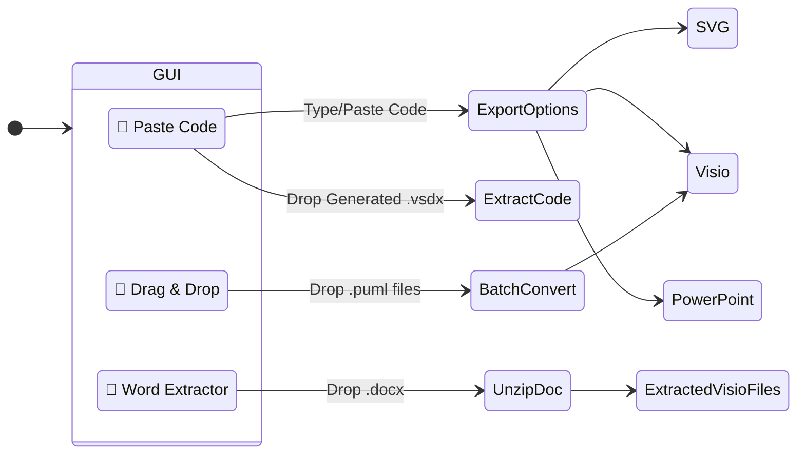

# 📊 PlantUML to Visio/PowerPoint Converter (3GPP Tools)

An advanced desktop application designed to bridge the gap between text-based diagramming (`PlantUML`) and corporate enterprise environments (`Microsoft Visio` and `PowerPoint`). 

Built specifically with telecommunications and 3GPP standards workflows in mind, this tool allows you to write highly efficient PlantUML sequence diagrams and instantly export them as fully editable native Office shapes.

> **🤖 AI-Assisted Development:** > The architecture, UI polishing, and complex Microsoft COM automation in this project were heavily co-developed using advanced Large Language Models (LLMs), allowing for rapid iteration and deep integration into native Windows APIs.

---

## 📑 Table of Contents
1. [✨ Features](#features)
2. [🏗️ Architecture & Data Flow](#architecture)
3. [⚙️ Prerequisites](#prerequisites)
4. [🚀 Installation](#installation)
5. [📖 How to Use the GUI](#usage)
6. [🛠️ Known Quirks / Troubleshooting](#troubleshooting)
7. [📜 License](#license)

---

## <a id="features"></a>✨ Features

* **Visio Integration:** Generates native `.vsdx` files from PlantUML text. Intelligently strips structural SVG wrappers so shapes are easily editable.
* **Native PowerPoint Export:** Bypasses standard image embedding by coercing PowerPoint into converting SVG paths into **native, grouped Office Drawing objects**. 
* **Flawless Round-Tripping:** Embeds your original PlantUML source code directly into the Visio Page or PowerPoint Speaker Notes. Drop a generated file back into the app to retrieve your source code!
* **Word Document Extractor:** Extracts hidden, embedded Visio (`.vsdx`) files natively trapped inside Word Document (`.docx`) OLE wrappers.
* **Intelligent Auto-Setup:** Automatically detects your Java environment and downloads the correct `plantuml.jar` on first launch (with Corporate Proxy support).

---

## <a id="architecture"></a>🏗️ Architecture & Data Flow



---

## <a id="prerequisites"></a>⚙️ Prerequisites

Because this application relies heavily on Microsoft's Component Object Model (COM) to natively manipulate diagrams, it requires a specific environment:

1. **Windows OS** (Required for COM automation).
2. **Microsoft Visio** and **Microsoft PowerPoint** installed locally.
3. **Java Runtime Environment (JRE)** (Java 11+ recommended to support the newest PlantUML features; Java 8 minimum).
4. **Python 3.8+**

---

## <a id="installation"></a>🚀 Installation

1. **Clone the repository:**
   ```bash
   git clone [https://github.com/telekom/3gpp-meeting-tools.git](https://github.com/telekom/3gpp-meeting-tools.git)
   cd 3gpp-meeting-tools/puml2visio
   ```

2. **Install the required Python packages:**
   Create a virtual environment (optional but recommended) and install dependencies:
   ```bash
   pip install PyQt5 pywin32
   ```

3. **Run the application:**
   ```bash
   python puml2visio.py
   ```
   *Note: On first launch, the app will automatically attempt to download `plantuml.jar`. If you are behind a corporate firewall, a proxy configuration dialog will appear to assist.*

---

## <a id="usage"></a>📖 How to Use the GUI

The application features three main workspaces, seamlessly navigated via tabs.



### 📝 Tab 1: Paste Code (Single Diagram Mode)
* **Generate:** Paste your PlantUML sequence diagram code into the text box. Click `Export Visio`, `Export PPTX`, or `Export SVG`. The application will generate the file, copy its path to your clipboard, and automatically open it.
* **Round-Trip Extract:** If you previously generated a Visio file using this tool, drag and drop the `.vsdx` file directly into the text box. The app will instantly read the Visio file and paste your original source code back onto the screen.

### 📂 Tab 2: Drag & Drop Files (Batch Mode)
* Drag a selection of `.txt` or `.puml` files from your file explorer and drop them onto the dashed area. 
* The application will queue them up and silently process them in the background, converting all of them into Visio files in their respective folders.

### 📄 Tab 3: Word Extractor
* When collaborating on 3GPP standards, Visio files are often deeply embedded inside Word documents as OLE objects. 
* Drag and drop a